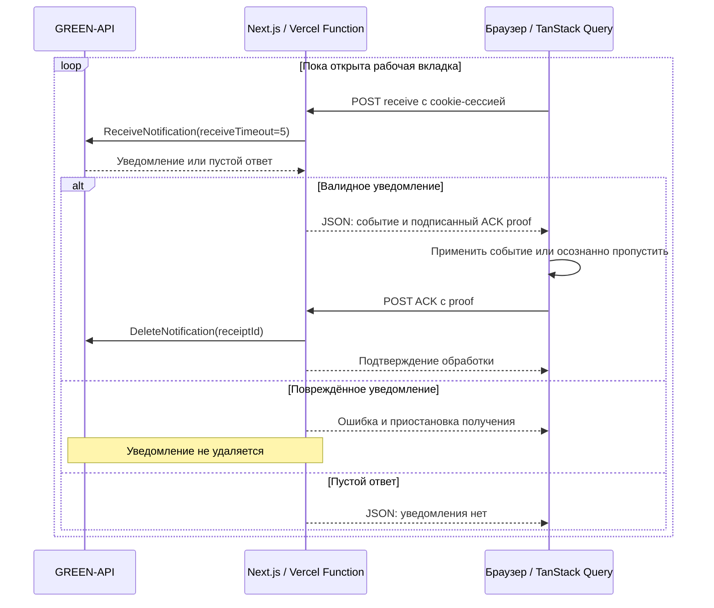

# GREEN-API Chat

Минимальный Telegram-клиент на React и Next.js для переписки через
[GREEN-API](https://green-api.com/telegram). Приложение позволяет подключить
свой инстанс, открыть личную переписку, отправить текст и получить ответ в
интерфейсе.

Проект выполнен по тестовому заданию на позицию Frontend-разработчика React.
Задание допускает Telegram; внешний вид основан на
[веб-версии MAX](https://web.max.ru/). Отправка использует SendMessage,
получение — Technology HTTP API с ReceiveNotification и DeleteNotification.

**Демо:** [green-api-chat-two.vercel.app](https://green-api-chat-two.vercel.app/).

[Запуск](#локальный-запуск) · [Архитектура](#архитектура) ·
[Методы API](#методы-green-api) · [Тесты](#тестирование) ·
[Документация GREEN-API](https://green-api.com/telegram/docs/)

## Пользовательский сценарий

1. Пользователь вводит `idInstance` и `apiTokenInstance` авторизованного
   Telegram-инстанса GREEN-API.
2. Приложение проверяет доступ и показывает профиль и список личных чатов.
3. Пользователь выбирает чат либо ищет получателя по телефону или username
   и нажимает «Написать».
4. При открытии чата загружаются свежие последние 10 сообщений.
5. Пользователь отправляет текст кнопкой либо Enter; Shift+Enter добавляет
   перенос строки.
6. Ответ из Telegram появляется через последовательные HTTP-запросы. Доставка и
   прочтение исходящих сообщений обновляются по уведомлениям GREEN-API.

На широком экране список и диалог расположены рядом, на телефоне отображается
одна панель. При первом открытии интерфейс использует системную светлую или
тёмную тему. Значок в правом верхнем углу над рамкой чата переключает тему
вручную; выбор сохраняется в этом браузере.

## Технологии

| Инструмент                     | Назначение                                               |
| ------------------------------ | -------------------------------------------------------- |
| React и TypeScript             | Интерфейс и типизированные контракты данных.             |
| Next.js App Router             | Страницы, серверная проверка сессии и HTTP-обработчики.  |
| TanStack Query                 | Запросы и временный кеш профиля, чатов и сообщений.      |
| iron-session                   | Зашифрованная HttpOnly cookie-сессия.                    |
| SCSS Modules                   | Стили компонентов, общие токены и адаптивная компоновка. |
| Vitest и React Testing Library | Node- и DOM-проверки без Next.js-сервера.                |
| Playwright                     | Query-сценарии в браузере и production E2E.              |
| ESLint, Stylelint, Prettier    | Проверки кода, стилей и форматирования.                  |

## Архитектура

Next.js объединяет интерфейс и серверные HTTP-обработчики. На Vercel запросы
могут исполняться разными экземплярами функции. Браузер обращается
к API приложения, сервер получает реквизиты из сессии и вызывает GREEN-API.
База данных и отдельный брокер сообщений не используются.

Код расположен по владельцам: `src/features/auth`, `account`, `recipients`,
`chats` и `conversation`; внутри переписки разделены выбор, история, сообщения,
отправка, уведомления и unread. `src/shared/kernel` содержит чистые общие
контракты, `src/shared/query` — нейтральный Query-сеанс, `src/shared/ui` —
общие компоненты. Доверенные GREEN-API/HTTP/session адаптеры находятся в
`src/server`, а `src/app` связывает их с Next.js routes и страницами.
Внешние импорты используют публичный вход нужного слоя (`model`, `application`,
`ui` или `server`), не смешивая клиентский и серверный runtime. Подробные
[архитектурные границы](docs/architecture.md) и [правила кода](docs/CODING_RULES.md)
поддерживаются вместе с проектом.

### Вход и сессия

Сервер проверяет реквизиты через GetStateInstance и создаёт сессию на 24 часа.
Содержимое cookie зашифровано; атрибут HttpOnly закрывает чтение cookie из
клиентского JavaScript. В production cookie также имеет атрибут Secure.
Для шифрования нужен серверный `SESSION_PASSWORD`.

Профиль аккаунта запрашивается через GetAccountSettings. Выход завершает
сессию текущего браузера и очищает его Query-кеш; другие устройства сохраняют
свои сессии.

### История и отправка

При открытии или повторном выборе чата GetChatHistory запрашивает свежие
10 сообщений. Ответ объединяется с уже известными сообщениями в памяти
Query: ключи учитывают подключение, `chatId` и `idMessage`. Накопленная
переписка может содержать больше 10 сообщений; пагинация старой истории
не реализована.

Текст отправляется через SendMessage по явному действию пользователя.
Пустой ввод и строка из пробелов блокируются; допустимый текст отправляется
с исходными пробелами и переносами. Одна отправка выполняется за раз на
подключение. Переключение чата очищает черновик, а поздний ответ остаётся
привязан к исходному чату.

Сообщение добавляется в переписку после успешного ответа API с `idMessage`.
Это подтверждение принятия, а доставка и прочтение определяются по отдельным
уведомлениям. Если исход отправки неизвестен, автоматического повтора нет:
пользователю предлагается проверить историю; ручной повтор может создать дубль.

После первого успешного подключения временный сбой фонового получения уведомлений
не блокирует отдельную отправку. При отправке виден обычный индикатор ожидания;
ошибка самого запроса сохраняет текст в редакторе и показывает результат попытки.

### Получение уведомлений

Используется [Technology HTTP API](https://green-api.com/telegram/docs/api/receiving/technology-http-api/).
Браузер последовательно вызывает серверный маршрут получения. Каждый вызов
ReceiveNotification ожидает событие до 5 секунд и завершает HTTP-запрос обычным
JSON-ответом. После обработки браузер отправляет отдельный ACK; до его завершения
следующее получение не начинается. SSE и постоянный серверный процесс не нужны.



Proof подписан серверным секретом, привязан к подключению, receiptId и сроку
действия. Получение и ACK могут исполняться на разных экземплярах Vercel.
Отправка JSON не считается подтверждением обработки. Валидное событие вне
поддерживаемых функций осознанно пропускается с ACK; повреждённое не удаляется.
При потере ответа повторная доставка не дублирует сообщение или счётчик.

Уведомления относятся ко всему инстансу. Переключение чата не создаёт новый
читатель очереди; событие сопоставляется с соответствующим chatId. Для
неизвестного чата сообщение сохраняется в Query, а список уточняется GetChats.

Web Locks разрешает одну рабочую вкладку с тем же подключением в одном браузере
на одном origin. Вторая вкладка показывает ограничение и не отправляет сообщения;
после закрытия первой можно повторить подключение. При отсутствии Web Locks
приложение показывает явное ограничение. Разные устройства, профили браузера,
подключения и адреса сайта не координируются: один инстанс следует использовать
в одном таком окружении. HTTPS Vercel и localhost поддерживают Web Locks.

Без рабочей вкладки новые запросы прекращаются, неподтверждённое уведомление
остаётся в очереди. При возвращении получение возобновляется, история открытого
чата обновляется. Уже начатая удалённая отправка может завершиться после закрытия.

Статусы сопоставляются по `idMessage`. История не понижает уже подтверждённую
доставку или прочтение устаревшим снимком. Отказ без `idMessage` отображается
как общая ошибка чата или подключения.

## Методы GREEN-API

| Метод                                                                                                             | Роль в приложении                                                     |
| ----------------------------------------------------------------------------------------------------------------- | --------------------------------------------------------------------- |
| [GetStateInstance](https://green-api.com/telegram/docs/api/account/GetStateInstance/)                             | Проверка авторизации инстанса при входе и проверке доступа.           |
| [GetAccountSettings](https://green-api.com/telegram/docs/api/account/GetAccountSettings/)                         | Информация об аккаунте для профиля в интерфейсе.                      |
| [CheckAccount](https://green-api.com/telegram/docs/api/service/CheckAccount/)                                     | Проверка получателя по телефону или username.                         |
| [GetChats](https://green-api.com/telegram/docs/api/service/GetChats/)                                             | Получение списка чатов и обновление его после новых событий.          |
| [GetChatHistory](https://green-api.com/telegram/docs/api/journals/GetChatHistory/)                                | Свежая история выбранного чата с `count: 10`.                         |
| [SendMessage](https://green-api.com/telegram/docs/api/sending/SendMessage/)                                       | Отправка текста и получение `idMessage` принятого сообщения.          |
| [GetSettings](https://green-api.com/telegram/docs/api/account/GetSettings/)                                       | Проверка настроек очереди и исходящих уведомлений.                    |
| [ReceiveNotification](https://green-api.com/telegram/docs/api/receiving/technology-http-api/ReceiveNotification/) | Получение очередного уведомления на сервере.                          |
| [DeleteNotification](https://green-api.com/telegram/docs/api/receiving/technology-http-api/DeleteNotification/)   | Удаление обработанного уведомления по `receiptId` после ACK браузера. |

Настройки инстанса меняются вручную в кабинете GREEN-API. Приложение не вызывает
SetSettings.

## Локальный запуск

### Требования

- Node.js **24.x** и npm **11.x**.
- Авторизованный Telegram-инстанс GREEN-API с `idInstance` и `apiTokenInstance`.
- Современный браузер с Web Locks (HTTPS либо localhost).

Скачайте или клонируйте репозиторий. Все команды выполняются из его корня.

### Установка и окружение

```sh
npm ci
```

Сгенерируйте секрет сессии:

```sh
node -e "process.stdout.write(require('node:crypto').randomBytes(32).toString('base64url'))"
```

Создайте `.env.local`:

```dotenv
SESSION_PASSWORD=<сгенерированное значение>
```

Секрет используется только сервером. Реквизиты GREEN-API вводятся на форме
входа; добавлять их в `.env.local` не требуется. Не сохраняйте секрет и токен
в репозитории.

### Настройка GREEN-API

Откройте [личный кабинет](https://console.green-api.com/), выберите свой
Telegram-инстанс и измените параметры раздела «Уведомления»:

| Поле                                                            | Значение | Назначение                        |
| --------------------------------------------------------------- | -------- | --------------------------------- |
| Адрес отправки уведомлений — `webhookUrl`                       | Пустой   | Получение очереди через HTTP API. |
| Входящие сообщения и файлы — `incomingWebhook`                  | Да       | Входящие сообщения.               |
| Сообщения, отправленные с телефона — `outgoingMessageWebhook`   | Да       | Исходящие сообщения из Telegram.  |
| Сообщения, отправленные через API — `outgoingAPIMessageWebhook` | Да       | Исходящие сообщения через API.    |
| Статусы отправленных сообщений — `outgoingWebhook`              | Да       | Доставка и прочтение.             |

Сохраните изменения. Названия параметров содержат `Webhook`, но при пустом
`webhookUrl` события получаются через очередь HTTP API. Режим отладки входящих
уведомлений для приложения не нужен.

Приложение проверяет входящие настройки перед запуском получателя. Если
исходящие переключатели выключены или отсутствуют в ответе GetSettings, оно
показывает подсказку о возможном отсутствии статусов; отправка остаётся доступна.
См. [описание настроек](https://green-api.com/telegram/docs/api/account/GetSettings/).

### Запуск

```sh
npm run dev
```

Откройте [http://localhost:3000/login](http://localhost:3000/login), введите
реквизиты инстанса и войдите. Если порт занят:

```sh
npm run dev -- --port 3001
```

В этом случае используйте `http://localhost:3001/login`. Для остановки сервера
нажмите Ctrl+C.

### Проверка полного сценария

1. Найдите получателя по телефону или username и нажмите «Написать».
2. Отправьте текст; после ответа API он появится в диалоге.
3. Ответьте из Telegram и убедитесь, что входящий текст появился без
   переключения чата и перезагрузки страницы.
4. Проверьте изменение статусов исходящего сообщения по фактическим событиям.
5. Нажмите «Выйти»; повторное открытие главной должно потребовать входа.

### Локальная production-сборка

При остановленном dev-сервере:

```sh
npm run build
npm run start
```

Проверка доступности сервера:
[http://localhost:3000/api/health](http://localhost:3000/api/health).
Успешный ответ — HTTP 200 с `{"status":"ok"}`. Этот маршрут проверяет
приложение, а не доступность GREEN-API.

## Тестирование

Все автоматические сценарии используют фиктивные данные и ответы GREEN-API.
Они не требуют реквизитов реального инстанса и не отправляют сообщения в
Telegram. Тестовое значение секрета сессии задаётся конфигурацией E2E.

Быстрые проверки логики и компонентов выполняются без Next.js-сервера и браузера:

```sh
npm test
npm run test:unit
npm run test:component
npm test -- tests/unit/recipient-label.test.ts
npm run test:watch
```

Vitest запускает Node unit/integration и jsdom component-наборы. React Testing
Library проверяет формы, хуки, провайдеры и настоящий development Strict Mode;
тесты создают отдельный QueryClient и очищают DOM, mocks и timers. Playwright
остаётся для реального Chromium: Next.js routes и cookie, Web Locks, несколько
вкладок, фокус, прокрутка, геометрия и адаптивная компоновка. Асинхронные
Server Components проверяются через production E2E.

Для браузерных проверок один раз установите Chromium:

```sh
npm run test:install-browser
```

| Набор              | Команда                    | Основные сценарии                                                                                                   |
| ------------------ | -------------------------- | ------------------------------------------------------------------------------------------------------------------- |
| Vitest integration | `npm run test:integration` | Серверные контракты и прикладные сценарии с фиктивным fetch, cookie и очередью.                                     |
| Query browser      | `npm run test:query`       | Настоящие Next API, браузерные вкладки/Web Locks, кеш, переключение чатов и очистка подключения.                    |
| Браузерные E2E     | `npm run test:e2e`         | Вход и выход, поиск, список, история, отправка, получение, статусы, клавиатурное управление и адаптивный интерфейс. |

Query-набор собирает отдельный тестовый стенд на порту **3102**. E2E собирают
production-приложение и запускают собственный сервер на порту **3101**.
Перед E2E остановите dev-сервер в этой папке; выполняйте наборы последовательно.

Проверки качества:

```sh
npm run typecheck
npm run lint
npm run lint:styles
npm run format:check
```

Команда typecheck последовательно проверяет три области: приложение и Playwright
(typecheck:app), Vitest (typecheck:tests), query-стенд (typecheck:query).
Для обоих Next.js приложений типы маршрутов генерируются перед tsc; предварительная
сборка не нужна. Сбой любой области завершает общую команду ошибкой.
Отдельные команды доступны для диагностики. Типы matchers Vitest изолированы
от Playwright; новые TS/TSX файлы в существующих исходных папках входят автоматически.
Для VS Code открывайте корень проекта: `tests/tsconfig.json` подключает тестовые
файлы к их TypeScript-конфигурации, включая алиас `@/` и DOM matchers. После
изменения конфигурации выполните `Developer: Reload Window` в редакторе.

HTML-отчёт последнего E2E-прогона:

```sh
npm run test:report
```

При ошибках E2E сохраняют скриншоты и трассировку. Автоматические тесты
проверяют поведение приложения на контролируемых ответах; реальную переписку
можно проверить сценарием выше со своим инстансом.

### Непрерывная проверка качества

GitHub Actions запускает workflow Quality на push в main/refactor и pull request.
На чистом Ubuntu runner с Node 24 и npm 11 выполняются npm ci, полный typecheck,
ESLint, Stylelint, Prettier и Vitest. Отдельная browser job запускает Playwright.
Все сценарии используют фиктивные данные; repository secrets не требуются.
Кеш npm ускоряет установку, но npm ci выполняется каждый раз.

Логи каждой команды доступны в шаге Actions и в артефакте
`quality-<run_attempt>`
в течение 7 дней, включая неуспешные проверки. Устаревший запуск той же ветки
отменяется. Ручной запуск доступен через `workflow_dispatch`. Отдельная browser
job устанавливает Chromium с системными библиотеками, последовательно запускает
query-стенд и E2E production-приложения и сохраняет HTML-отчёты, traces и
скриншоты в артефакте `browser-<run_attempt>`.
Общий запуск успешен только при успехе обеих jobs.

## Ограничения и размещение

- Поддерживаются личные текстовые переписки. Группы и отправка вложений
  не реализованы; нетекстовое сообщение отображается нейтральной строкой.
- Свежая история ограничена последними 10 сообщениями. Старые известные
  сообщения остаются в памяти текущего подключения, но подгрузки истории нет.
- Перезагрузка страницы теряет Query-кеш. Постоянного журнала событий и
  гарантированного восстановления всей переписки нет.
- GREEN-API хранит очередь уведомлений до 24 часов;
  [описание HTTP API](https://green-api.com/telegram/docs/api/receiving/technology-http-api/).
- Одна рабочая вкладка ограничивается Web Locks в одном browser origin/подключении;
  несколько устройств и независимые окружения могут конкурировать за очередь.
- Receive/settings ограничены серверным deadline 8 секунд, ACK — до 16 секунд;
  маршруты Vercel имеют maxDuration 20 секунд. После ошибок используется backoff.
  Активная вкладка регулярно вызывает функции: учитывать лимиты тарифа Vercel и GREEN-API.

### Размещение на Vercel

1. Импортируйте GitHub-репозиторий в Vercel. Оставьте корневой каталог `./`,
   выберите preset Next.js и стандартные настройки сборки. Проект требует
   Node.js 24.x, заданный в `package.json`.
2. Сгенерируйте отдельный секрет командой из раздела «Установка и окружение».
   В Environment Variables добавьте `SESSION_PASSWORD` минимум из 32 символов
   для Production. Для Preview, если оно нужно, задайте отдельное значение.
   Секрет должен быть одинаковым для всех функций внутри одного окружения;
   префикс `NEXT_PUBLIC_` не добавляйте.
3. Нажмите Deploy. После изменения переменной запустите Redeploy; смена секрета
   завершит действующие сессии и потребует повторного входа.
4. На HTTPS-адресе проверьте вход, историю, отправку и получение сообщения,
   статусы, две вкладки и выход.

Реквизиты GREEN-API вводятся в форме входа; дополнительные переменные
окружения, Redis и отдельный Node-сервис не нужны. Не проверяйте одновременно
localhost и Vercel с одним инстансом: эти адреса не делят владение очередью.
Локальная сборка и фиктивные тесты не заменяют проверку опубликованной версии.

## Как разрабатывался проект

Проект разрабатывался совместно с AI-ассистентом Codex. Требования, приоритеты
и решения по пользовательскому сценарию принимались человеком; Codex помогал
исследовать код, готовить документы, реализовывать изменения и проводить ревью
и проверки. Результат каждой задачи сверялся с согласованными требованиями.

Работа велась по **SDD (Spec-Driven Development)** с локально адаптированным
[GitHub Spec Kit](https://github.com/github/spec-kit). Для каждой задачи сначала
описывались сценарии, ограничения и критерии приёмки, затем составлялись
технический план и проверяемые шаги реализации. [Комплекты спецификаций](specs/)
хранятся в репозитории.
Для новой и изменённой бизнес-логики применялся TDD: падающий тест на ожидаемое
поведение (Red), минимальная реализация (Green), затем рефакторинг с повторной
проверкой. После реализации выполнялись автоматические тесты и предкоммитное
ревью. Подробности — в [локальном процессе Spec Kit](docs/spec-kit-workflow.md)
и [описании его адаптации](docs/spec-kit-provenance.md).
